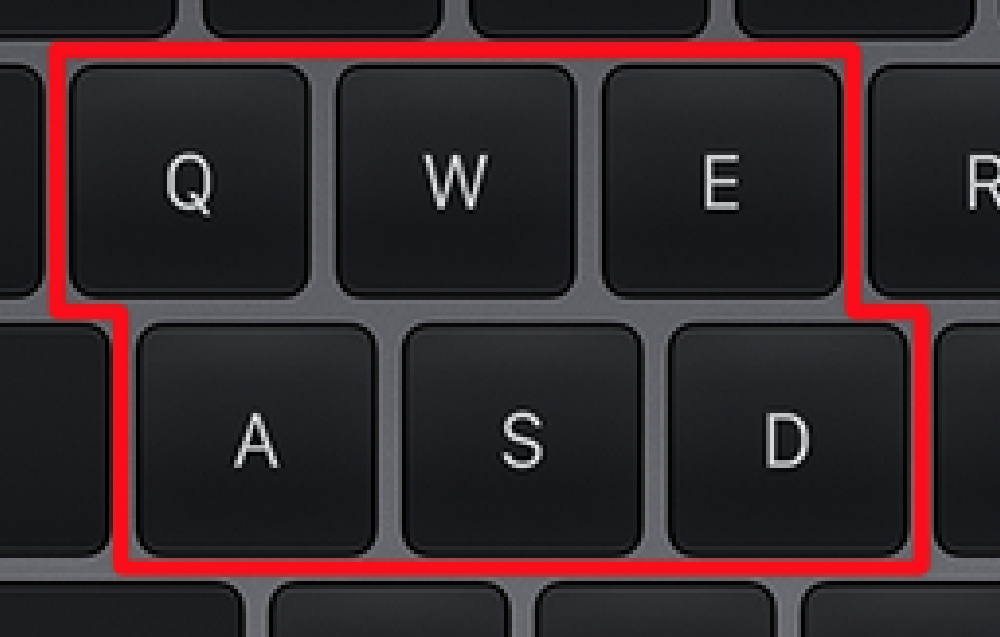
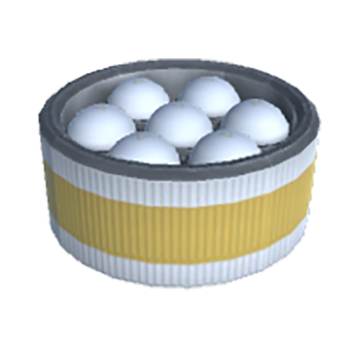
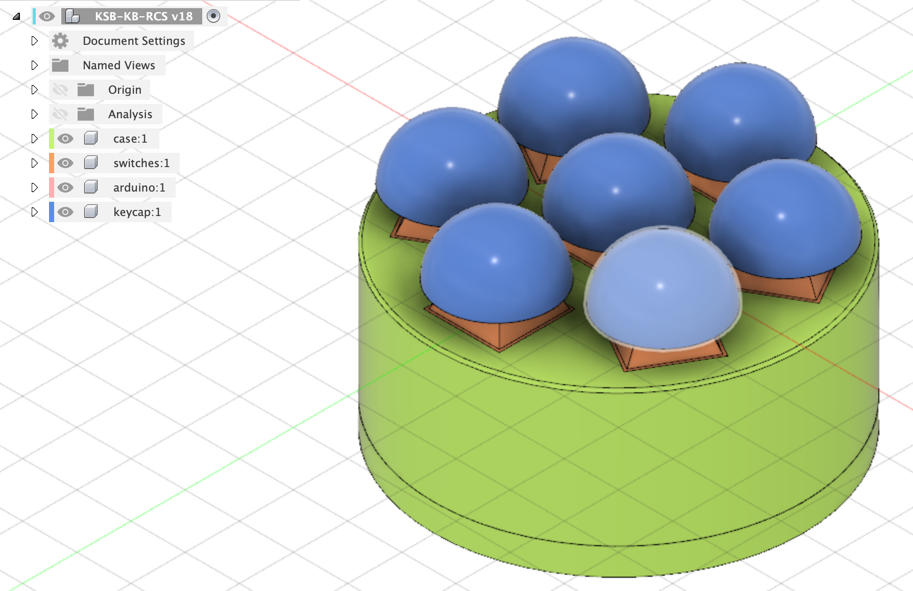
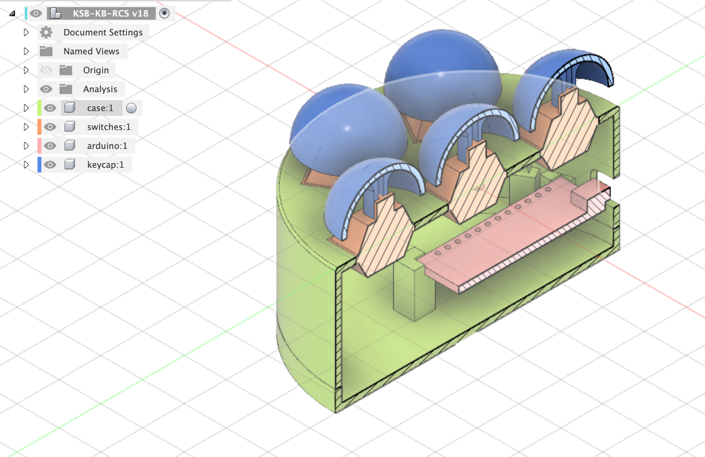
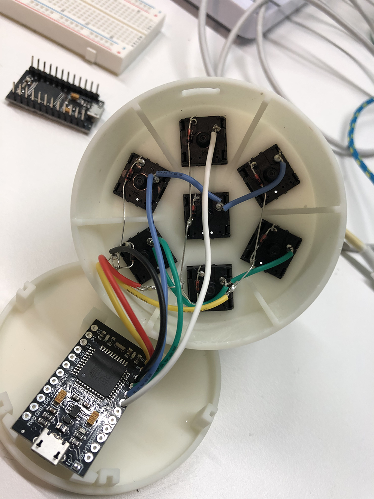
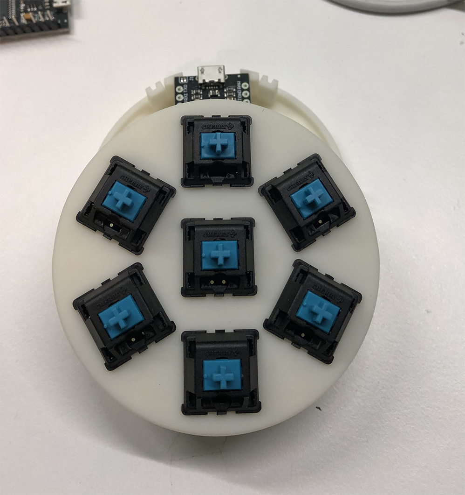
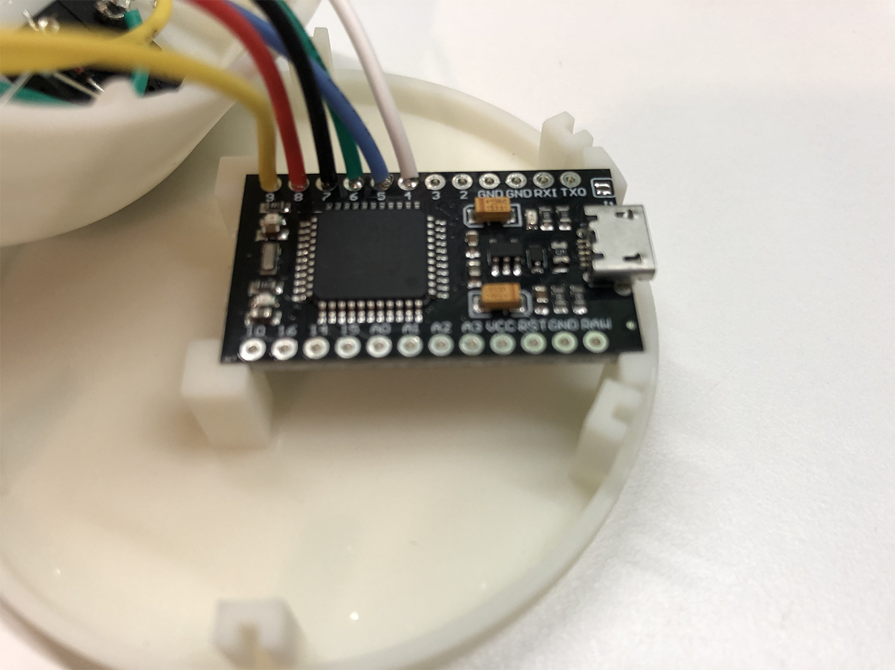
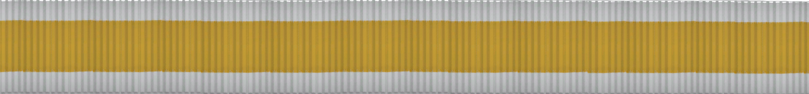
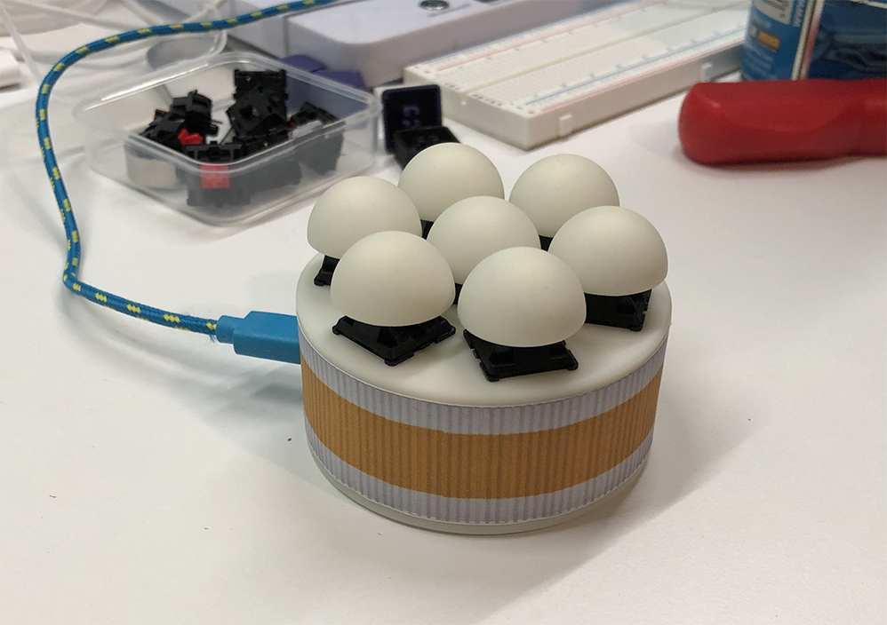

# KSP-RCS-KB

## Kerbal Space Program - Reaction Control System - Keyboard

#### Overview

The key bindings for flight control in the fantastic [Kerbal Space Program](https://www.kerbalspaceprogram.com/) are the perfectly reasonable WASD(QE) keys. W&S control pitch, A&D control yaw, and Q&E are used for roll.

When using the RCS (Reaction Control System) for vessel orientation and maneuvering though the key bindings use HJKLIN?!

We can do better!

#### Brief

Model, print, wire, and program a 6/7 button keypad to control RCS maneuvering in KSP. The layout should be similar to the WASDQE layout used for flight controls. Make the finished unit look like something from the game assets, for extra coolness!

#### Design

The unit is designed to look like an RCS tank from KSP, the layout of one central sphere surrounded by six others means an extra button is provided which will be used to toggle RCS control.

To aid assembly the case has separate top and bottom shells which are friction fit. The bottom of the case houses the microcontroller.

#### Prototyping

Rapid prototypes are printed on the [Creality CR6-SE](https://www.creality3dofficial.com/collections/creality3d-eu-warehouse-in-stock/products/creality-cr-6-se-3d-printer) to test for size, shape, and fit of components. A number of options for mounting the microcontroller are tested before deciding on the final solution of mounting it to the bottom case piece using standoffs.

#### Final Product

The finished article is printed on the [Elegoo Mars](https://www.elegoo.com/products/elegoo-mars-lcd-3d-printer) in white, water-washable resin.

An Arduino Pro-Micro [ATmega32](https://www.amazon.co.uk/gp/product/B07DF5CPTB/) can emulate a keyboard and sample code is available from within the Arduino IDE. Cherry MX mechanical switches are selected for the inputs, preferring the switch profile of the [blues](https://www.amazon.co.uk/gp/product/B08C7X5JTW/).

The switches are wired in a [matrix](https://en.wikipedia.org/wiki/Keyboard_matrix_circuit) with [diodes](https://www.amazon.co.uk/gp/product/B07ZCVQ6KJ/) between the column pins to prevent ghosting. The wires for the rows and columns are soldered directly to IO pins 4-9 of the Arduino.

#### Code

The [Adafruit generic keypad](https://github.com/adafruit/Adafruit_Keypad/blob/master/examples/keypad_generic/keypad_generic.ino) code is used as the basis for the [custom keypad](./ksp-rcs-kb.ino), including the Arduino standard library `Keyboard.h` to send key-press and key-release to the host computer.

#### Finishing up

To add to the final look a decal is printed on adhesive vinyl to match the game asset.

Before being stuck to the case.

